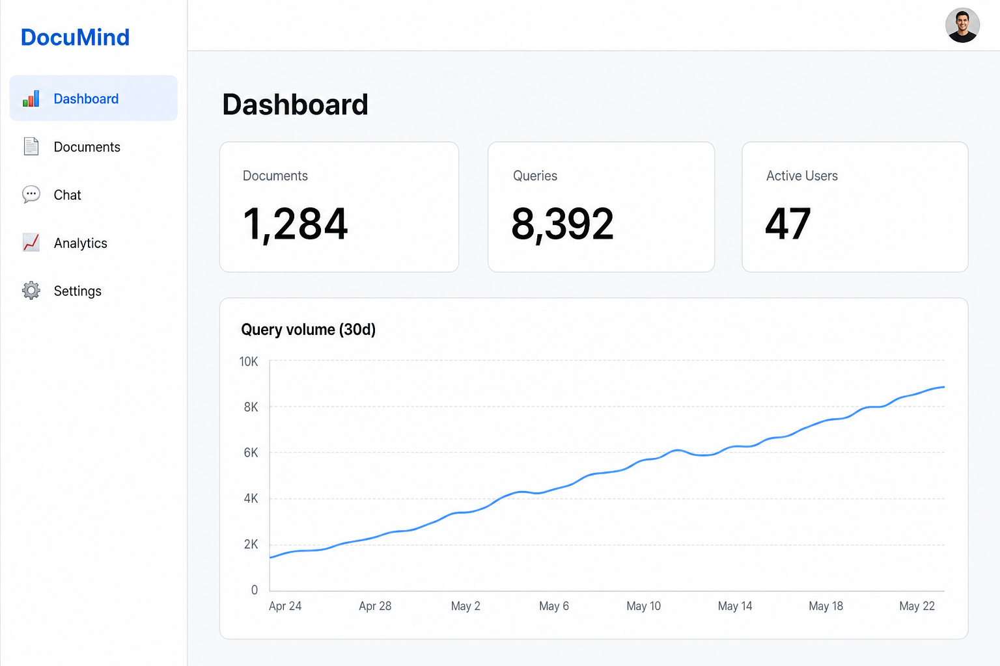
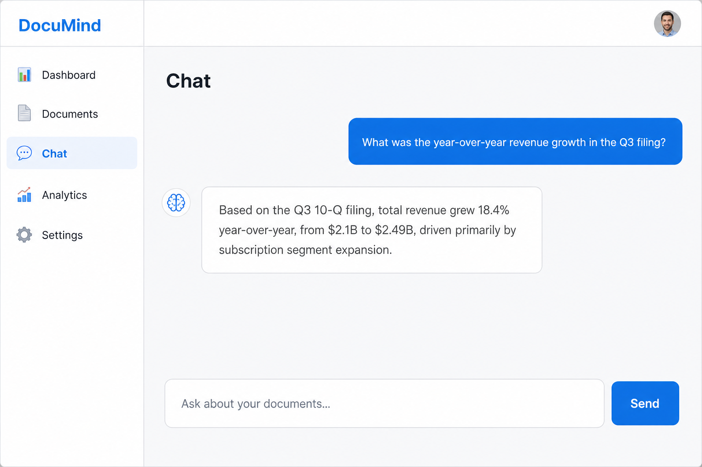
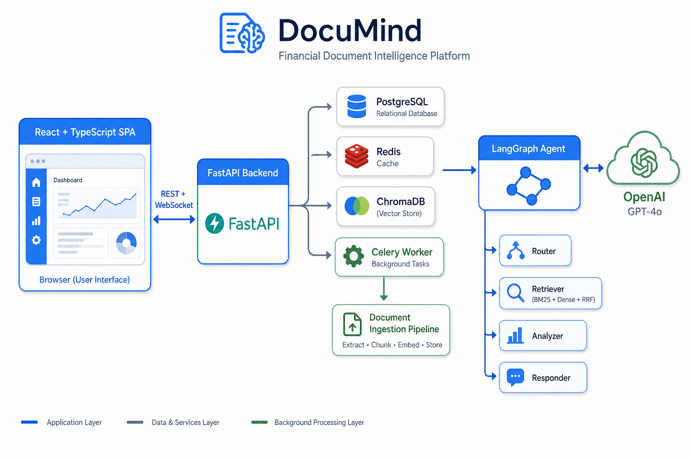

<div align="center">

# 🧠 DocuMind

**Financial Document Intelligence Platform**

An enterprise-grade Retrieval-Augmented Generation (RAG) platform for SEC filings, earnings
transcripts, and balance sheets — featuring hybrid retrieval, a LangGraph reasoning agent,
multi-tenant isolation, and real-time streaming answers.

[](https://github.com/abedmandour/documind/actions)
[](./LICENSE)
[](https://www.python.org)
[](https://react.dev)
[](https://fastapi.tiangolo.com)

</div>

---

## ✨ Overview

DocuMind lets teams upload financial documents and ask natural-language questions about them.
A LangGraph agent routes each query, retrieves the most relevant passages using a hybrid
(keyword + semantic) strategy, analyzes them, and streams a grounded answer back to the UI in
real time. Everything is multi-tenant and isolated at the query layer.

| | |
|---|---|
| 💬 **Conversational Q&A** | Streaming WebSocket chat grounded in your documents |
| 📄 **Async ingestion** | Drag-and-drop PDF / DOCX / TXT, processed by Celery workers |
| 🔎 **Hybrid retrieval** | BM25 keyword + dense embeddings fused with Reciprocal Rank Fusion |
| 🤖 **Agentic reasoning** | LangGraph router → retriever → analyzer → responder |
| 🏢 **Multi-tenant** | Per-organization isolation enforced on every query |
| 📊 **Analytics** | Usage dashboards, query trends, and document insights |
| 🔐 **Auth** | JWT access / refresh tokens with OAuth2 password flow |

---

## 🖼️ Screenshots

> Rendered previews of the actual UI (clean React + Tailwind design).

### Dashboard


### Chat


---

## 🏗️ Architecture



| Layer | Technology |
|-------|-----------|
| **Frontend** | React 18, TypeScript, Tailwind CSS, Zustand, Recharts, Vite |
| **Backend** | FastAPI, Pydantic, SQLAlchemy, Alembic |
| **Agent / RAG** | LangGraph, LangChain, OpenAI GPT-4o, hybrid retrieval + RRF |
| **Datastores** | PostgreSQL (metadata), ChromaDB (vectors), Redis (cache / broker) |
| **Async** | Celery workers for document ingestion & embedding |
| **Storage** | AWS S3 with a local-filesystem fallback for dev |
| **Infra** | Docker Compose, Kubernetes (Helm), Terraform, Prometheus + Grafana |

---

## 🚀 Quick start

### Prerequisites
- [Docker Desktop](https://www.docker.com/products/docker-desktop/) (with Docker Compose)
- An **OpenAI API key** (used for embeddings + chat completions)

### 1. Configure environment

```bash
cp backend/.env.example backend/.env
```

Then edit `backend/.env` and set:

```env
SECRET_KEY=<any long random string>     # e.g. `openssl rand -hex 32`
OPENAI_API_KEY=sk-...                    # required
```

> The database, Redis, and ChromaDB connection strings already point at the Compose
> services, so no other changes are needed for local development.

### 2. Launch the stack

```bash
docker compose up -d --build
```

This starts the backend, frontend, PostgreSQL, Redis, ChromaDB, a Celery worker, and the
Prometheus/Grafana monitoring stack. Database migrations run automatically on backend startup.

### 3. Open the app

| Service | URL |
|---------|-----|
| **Web UI** | http://localhost:3000 |
| **API docs** (Swagger) | http://localhost:8000/docs |
| **Grafana** | http://localhost:3001 |
| **Prometheus** | http://localhost:9090 |

Register an account from the login screen (or via `POST /api/v1/auth/register`), sign in, and
start uploading documents and chatting.

---

## 🔑 What you need to run it

Only **one secret is required**: an `OPENAI_API_KEY`. Everything else has sensible local
defaults. No credentials are committed to the repository — `.env` files are git-ignored and only
`.env.example` (with placeholders) is tracked.

| Variable | Required | Default | Purpose |
|----------|:--------:|---------|---------|
| `OPENAI_API_KEY` | ✅ | — | Embeddings + chat completions |
| `SECRET_KEY` | ✅ | — | JWT signing |
| `DATABASE_URL` | — | local Postgres | Metadata storage |
| `REDIS_URL` | — | local Redis | Cache + Celery broker |
| `CHROMA_HOST` / `CHROMA_PORT` | — | `chroma:8000` | Vector store |
| `AWS_*` | — | _(empty)_ | S3 storage; falls back to local disk if unset |

---

## 🧱 Project structure

```
documind/
├── backend/                 # FastAPI application
│   ├── app/
│   │   ├── agents/          # LangGraph agent graph + nodes
│   │   ├── api/v1/          # REST + WebSocket endpoints
│   │   ├── core/            # Security, config, dependencies
│   │   ├── models/          # SQLAlchemy models
│   │   ├── rag/             # Hybrid retriever + vector store
│   │   ├── services/        # Business logic (agent, storage, audit…)
│   │   └── tasks/           # Celery workers
│   └── alembic/             # Database migrations
├── frontend/                # React + TypeScript + Tailwind SPA
│   └── src/
│       ├── pages/           # Dashboard, Chat, Documents, Analytics, Settings
│       ├── components/      # Layout, Sidebar, Navbar, ErrorBoundary
│       ├── store/           # Zustand auth store (persisted)
│       └── api/             # Axios client with JWT refresh
├── helm/ · k8s/ · terraform/  # Deployment & infra
├── monitoring/              # Prometheus config
└── docker-compose.yml
```

---

## 🛠️ Development

Common tasks are available via the `Makefile`:

```bash
make dev        # start datastores via compose + run backend with reload
make migrate    # apply alembic migrations
make test       # run the backend test suite with coverage
make lint       # ruff + mypy
make fe-dev     # run the frontend dev server (Vite)
make logs       # tail backend + worker logs
```

---

## 🧪 Tech highlights

- **Hybrid retrieval with RRF** — combines lexical (BM25) and semantic (dense embedding)
  search, then fuses ranks for higher recall on financial terminology.
- **LangGraph agent** — a typed state graph that routes between direct answers and
  retrieval-augmented reasoning, with discrete router / retriever / analyzer / responder nodes.
- **Streaming responses** — answers stream token-by-token over WebSocket; internal reasoning
  steps are kept server-side and never leak into the chat.
- **Lazy service initialization** — vector store connections are created on first use, keeping
  container startup fast and resilient to service ordering.
- **Resilient frontend** — persisted auth state, automatic JWT refresh, and a global error
  boundary.

---

## 📄 License

Released under the [MIT License](./LICENSE).
